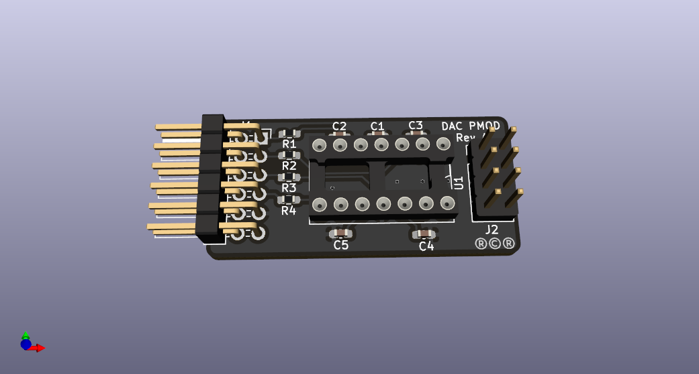

# DAC PMOD

This is a 4-channel sigma-delta DAC PMOD.  This provides an RC-filtered
and op-amp buffered output for a sigma delta modulator.

The resistor and capacitor values are not specified.  The expectation
is that users will have their own requirements for the filter cut-off.

When calculating the component values for the cut-off frequency of the
RC filter, bear in mind that a 200 ohm series resistor exists on each
PMOD signal line.

This repo contains KiCAD files and Gerbers for those wanting to make their
own boards.

This project is OSHW (Open Source Hardware), released under the GPLv3 license.

If you are interested in purchasing kits or complete modules, please contant
me at rob@mobilinkd.com.

